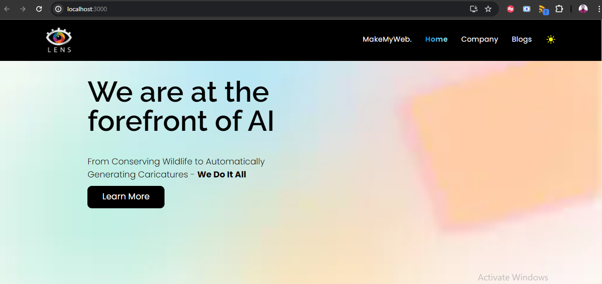

# LensCrop AI Clone

Welcome to LensCrop AI Clone! This project is a web application built using React and Tailwind CSS, designed to mimic the functionality of LensCrop AI.

## Getting Started
To get started with LensCrop AI Clone, follow these simple steps:

1. Clone the project repository to your local machine:

2. Navigate into the project directory:

3. Install the necessary dependencies using npm: `npm install`

4. Start the development server: `npm start`

5. Once the server is running, open your browser and navigate to `http://localhost:3000` to view the application.

## Features
- **Dark and Light Theme:** Toggle between dark and light themes seamlessly with the toggle button on the home page.

# Light Theme

# Dark Theme

- **Responsive Design:** The application incorporates responsive design, ensuring optimal viewing and interaction experience across a wide range of devices and screen sizes. 

https://github.com/VivBelwal/lenscrop_ai/assets/107463324/0d61216b-71e1-4d2f-b6dd-3471d9869663

- Explore the functionalities of LensCrop AI Clone, experiment with different features, and enjoy a seamless experience!

